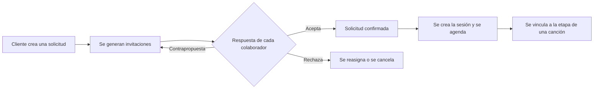
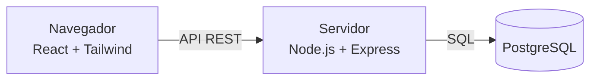

<div align="center">

# Z-ONE

### Sistema de gestión integral para una productora musical

**Universidad Popular del Cesar** · Programación wed · Septiembre de 2026


**Lenguajes**


**Frameworks, herramientas y plataformas**


</div>

---

## Tabla de contenido

1. [Introducción](#introducción)
2. [Contexto académico](#contexto-académico)
3. [Objetivos](#objetivos)
4. [Alcance](#alcance)
5. [Módulos del sistema](#módulos-del-sistema)
6. [Flujo principal](#flujo-principal)
7. [Reglas de negocio](#reglas-de-negocio)
8. [Modelo de datos](#modelo-de-datos)
9. [Arquitectura y tecnologías](#arquitectura-y-tecnologías)
10. [Seguridad](#seguridad)
11. [Estructura del repositorio](#estructura-del-repositorio)
12. [Instalación y ejecución](#instalación-y-ejecución)
13. [Roles y permisos](#roles-y-permisos)
14. [Flujo de trabajo con Git](#flujo-de-trabajo-con-git)
15. [Convenciones de código](#convenciones-de-código)
16. [Pruebas y calidad](#pruebas-y-calidad)
17. [Estado actual del proyecto](#estado-actual-del-proyecto)
18. [Hoja de ruta](#hoja-de-ruta)
19. [Equipo](#equipo)
20. [Documentación](#documentación)
21. [Licencia](#licencia)

---

## Introducción

**Z-ONE** es un sistema de gestión integral para una productora musical. Centraliza en una sola plataforma el trabajo que normalmente se reparte entre chats, hojas de cálculo y agendas sueltas: la solicitud de sesiones de grabación, la coordinación de músicos e ingenieros, el seguimiento de cada canción a lo largo de su producción y la entrega de resultados al cliente.

**El problema que resuelve:** coordinar una sesión implica ponerse de acuerdo con varias personas a la vez. Z-ONE permite que el cliente proponga una sesión, que **cada colaborador convocado acepte, rechace o negocie su participación**, y que solo cuando todo está acordado se confirme y agende la sesión, evitando cruces de horario y malentendidos.

**A quién sirve**

| Usuario | Qué obtiene |
|---|---|
| **Cliente** | Pedir sesiones, ver su agenda y aprobar los entregables de su proyecto |
| **Colaborador** | Recibir invitaciones con tarifa, responderlas y ver su agenda y sus tareas |
| **Coordinador** | Confirmar solicitudes, gestionar la agenda y el avance de las canciones |
| **Administrador** | Control total: configuración, aprobación de colaboradores, estadísticas y auditoría |

## Contexto académico

Este proyecto nació en la asignatura **Programación 2** y evoluciona como proyecto para **Exposoftware**, con una arquitectura profesional: front-end moderno, API con reglas de negocio y base de datos relacional.

| | |
|---|---|
| **Institución** | Universidad Popular del Cesar |
| **Asignatura de origen** | Programación 2 |
| **Evento** | Exposoftware |
| **Fecha** | Septiembre de 2026 |

## Objetivos

**Objetivo general:** desarrollar un sistema web que permita gestionar de forma integral las sesiones, los colaboradores y las canciones de una productora musical.

**Objetivos específicos**
- Migrar el front-end original (HTML, CSS y JavaScript) a una aplicación React mantenible, con un sistema de diseño coherente.
- Construir un backend con autenticación real y permisos por rol verificados en el servidor.
- Implementar el flujo completo solicitud → invitación → sesión con control de traslapes.
- Gestionar canciones con etapas, tareas y entregables, con avance calculado automáticamente.
- Aplicar control de versiones profesional: ramas protegidas, pull requests revisados y versiones etiquetadas.

## Alcance

| Nivel | Contenido |
|---|---|
| **Incluido** | Migración del front, autenticación, 4 roles y permisos, solicitudes, invitaciones, sesiones, agenda, canciones, etapas, tareas, entregables, dashboard, estadísticas, auditoría y aprobación de colaboradores |
| **Opcional** | Propuesta de splits por colaboradores, pruebas automáticas de extremo a extremo, despliegue en línea |
| **No incluido** | Notificaciones, facturación, pagos, liquidaciones, mensajería interna, WhatsApp, push y correo |

## Módulos del sistema

| Módulo | Descripción |
|---|---|
| **Autenticación y roles** | Registro e inicio de sesión con contraseñas cifradas; cuatro roles con permisos distintos |
| **Solicitudes** | Solicitud con código (`SOL-2026-0001`), fecha, horario, sala, estado y vencimiento |
| **Invitaciones** | Una invitación por colaborador, con rol, instrumento, tarifa ofrecida y contrapropuesta |
| **Sesiones y agenda** | Calendario interactivo, recursos por sesión, check-in y check-out, control de traslapes |
| **Canciones** | Datos de la obra (género, BPM, tonalidad, duración), estado de producción y publicación |
| **Etapas y tareas** | Etapas ordenadas con responsable y bloqueos; tareas con prioridad, estado y fecha límite |
| **Entregables** | Subida de versiones y aprobación por el cliente |
| **Dashboard y estadísticas** | Indicadores adaptados a cada rol |
| **Auditoría** | Registro de acciones sensibles, visible solo para el administrador |
| **Administración** | Configuración del sistema y aprobación de nuevos colaboradores |

## Flujo principal



## Reglas de negocio

- Una **solicitud vence** automáticamente en su fecha límite si no se confirma.
- Solo el **colaborador invitado** puede responder su invitación; el administrador puede forzarla y el coordinador no responde por otros.
- La solicitud se **confirma** cuando todas las invitaciones requeridas fueron aceptadas, o de forma manual por un administrador o coordinador.
- La **sesión nace de una solicitud confirmada** y puede vincularse a una etapa de una canción.
- **No pueden existir dos sesiones traslapadas** en la misma sala; la restricción se aplica en la propia base de datos.
- Una **etapa bloqueada** no puede iniciar hasta que se complete la etapa que la bloquea.
- El **avance de una canción** se calcula a partir de sus etapas; no se edita a mano.
- Solo el **administrador** marca una canción como publicada.
- El **cliente** puede cancelar su propia sesión, sujeto a una política de cancelación.

## Modelo de datos

Entidades principales (PostgreSQL):

| Entidad | Propósito |
|---|---|
| `usuario`, `colaborador` | Personas del sistema y su perfil profesional |
| `sala` | Espacios de grabación |
| `solicitud` | Petición del cliente para una sesión |
| `invitacion` | Convocatoria individual a un colaborador, con su respuesta |
| `sesion`, `sesion_recurso` | Sesión confirmada y las personas que participan en ella |
| `cancion`, `cancion_etapa` | Obra musical y sus etapas de producción |
| `tarea` | Trabajo concreto dentro de una etapa |
| `auditoria` | Historial de acciones sensibles |

El esquema se gestiona con **migraciones versionadas** en `backend/db/migrations/`. Nunca se edita una migración ya fusionada: se crea una nueva.

## Arquitectura y tecnologías



| Capa | Tecnología |
|---|---|
| Front-end | React, Vite, React Router |
| Estilos y componentes | Tailwind CSS, shadcn/ui |
| Animaciones | anime.js |
| Backend | Node.js, Express |
| Base de datos | PostgreSQL |
| Entorno local | Docker y Docker Compose |
| Calidad | ESLint, Prettier, GitHub Actions |

## Seguridad

- **Toda regla de permisos se verifica en el servidor.** El front-end solo muestra u oculta opciones por comodidad; ocultar un botón no es seguridad.
- Las contraseñas se almacenan **cifradas** (nunca en texto plano).
- Las claves y credenciales viven en el archivo `.env`, que **no se sube** al repositorio.
- La **integridad de los datos** se refuerza en la base de datos con claves foráneas, restricciones `UNIQUE` y `CHECK`.
- Las acciones sensibles quedan registradas en la **auditoría**.

## Estructura del repositorio

```
z_one_wed/
├── docs/                 # plan de trabajo, decisiones y pruebas
├── frontend/             # aplicación React
├── backend/              # API, migraciones y semillas
├── legacy/               # front antiguo (se elimina al terminar la migración)
├── .github/workflows/    # verificaciones automáticas
├── docker-compose.yml    # PostgreSQL local
├── .env.example          # variables de entorno de ejemplo
├── CHANGELOG.md
└── README.md
```

## Instalación y ejecución

> Los comandos exactos se confirman al terminar el Sprint 1. Si algún script aún no existe, revisa el estado en el [plan de trabajo](docs/PLAN_DE_TRABAJO.md).

**Requisitos previos:** [Node.js](https://nodejs.org) (LTS), [Docker](https://www.docker.com/) y [Git](https://git-scm.com/).

**1. Clonar** ( para no dañar la carpeta `.git`)
```bash
git clone https://github.com/jmfigueroa366/z_one_wed.git
cd z_one_wed
```

**2. Variables de entorno**
```bash
cp .env.example .env
```
En PowerShell: `Copy-Item .env.example .env`. Edita `.env` con tus valores y **nunca lo subas al repositorio**.

| Variable | Descripción |
|---|---|
| `DATABASE_URL` | Cadena de conexión a PostgreSQL |
| `JWT_SECRET` | Clave para firmar las sesiones |
| `PORT` | Puerto de la API |

**3. Base de datos**
```bash
docker compose up -d
```

**4. Backend**
```bash
cd backend
npm install
npm run migrate    # crea las tablas
npm run seed       # carga un usuario de prueba por rol
npm run dev
```

**5. Front-end** (en otra terminal)
```bash
cd frontend
npm install
npm run dev
```

Aplicación en `http://localhost:5173` y API en `http://localhost:3000`.

**Problemas frecuentes**

| Problema | Solución |
|---|---|
| No conecta a la base de datos | Verifica que Docker esté abierto y que `docker compose up -d` haya terminado |
| Puerto ocupado | Cambia `PORT` en `.env` o cierra el proceso que lo usa |
| `git` falla dentro de OneDrive | Mueve el repositorio a una carpeta fuera de OneDrive, como `C:\dev` |

## Roles y permisos

| Rol | Puede |
|---|---|
| **Admin** | Todo: configuración, auditoría, aprobación de colaboradores y estadísticas globales |
| **Coordinador** | Ver la agenda global, crear y confirmar solicitudes, editar etapas |
| **Colaborador** | Responder sus invitaciones, ver su agenda, trabajar en su etapa asignada |
| **Cliente** | Crear solicitudes, ver su agenda y aprobar entregables |

## Flujo de trabajo con Git

Cada integrante trabaja en su rama personal y **nadie fusiona directo a `main`**.

```
frontN  →  Pull Request  →  develop  →  Pull Request  →  main  (+ tag de versión)
```

| Rama | Uso |
|---|---|
| `main` | Versión estable y presentable; protegida |
| `develop` | Integración; protegida |
| `front1`, `front2`, `front3` | Ramas personales de cada integrante |

**Rutina diaria**
```bash
git switch front1
git pull origin develop      # traer lo que hicieron los demás
# ... trabajar ...
git add <archivos concretos>
git commit -m "feat(invitacion): agrega aceptar y rechazar"
git push origin front1
# al terminar una tarea: abrir Pull Request hacia develop
```

**Reglas**
- Los pull requests los revisa **otra persona** y deben pasar `lint` y `build`.
- Prohibido `git push --force` y `git reset --hard` en ramas compartidas.
- Las versiones se etiquetan con tags semánticos (`v0.1.0` hasta `v1.0.0`) y se documentan en el `CHANGELOG.md`.

Los detalles completos están en la sección 9 del [plan de trabajo](docs/PLAN_DE_TRABAJO.md).

## Convenciones de código

**Mensajes de commit** ([Conventional Commits](https://www.conventionalcommits.org/es))

| Tipo | Uso | Ejemplo |
|---|---|---|
| `feat` | Nueva funcionalidad | `feat(agenda): agrega vista semanal` |
| `fix` | Corrección de errores | `fix(login): corrige validación de correo` |
| `refactor` | Reorganización sin cambiar el comportamiento | `refactor(catalogo): migra a componentes React` |
| `style` | Estilos y formato | `style(agenda): reemplaza CSS por Tailwind` |
| `docs` | Documentación | `docs(readme): actualiza instalación` |
| `chore` | Mantenimiento y dependencias | `chore(deps): agrega animejs` |

**Código**
- Formato automático con Prettier y revisión con ESLint.
- Componentes React con nombres en `PascalCase`; archivos y carpetas del resto del proyecto en minúsculas.
- Un módulo, un dueño: los archivos compartidos cambian solo por pull request pequeño y con aviso.
- Las animaciones se centralizan en un solo hook y respetan la preferencia de movimiento reducido del usuario.

## Pruebas y calidad

- **Por rol:** cada funcionalidad se prueba con Admin, Coordinador, Colaborador y Cliente.
- **Permisos:** por cada acción, un caso permitido y uno denegado (`403`).
- **Flujo completo:** solicitud → invitaciones → confirmación → sesión.
- **Casos límite:** invitación vencida, traslape de horario, etapa bloqueada, cancelación del cliente.
- **Automático:** `lint` y `build` con GitHub Actions en cada pull request.
- Los resultados se documentan en [`docs/pruebas.md`](docs/pruebas.md).

## Estado actual del proyecto

**Ya existe (front-end original):** inicio de sesión, registro, página principal, agenda, artistas, catálogo, chatbot, configuración, dashboard, estadísticas y sesiones.

**En proceso:** migración del front a React, backend con PostgreSQL, autenticación real y el flujo solicitud → invitación → sesión.

**Próximamente:** capturas de pantalla y una demostración en línea.

## Hoja de ruta

Desarrollo en **3 meses**, en 6 sprints de 2 semanas.

| Sprint | Semanas | Enfoque |
|---|---|---|
| 1 | 1 y 2 | Cimientos: repositorio, entorno, base de datos y front-end base |
| 2 | 3 y 4 | Autenticación, roles y permisos; primeras pantallas migradas |
| 3 | 5 y 6 | Solicitudes, invitaciones y canciones |
| 4 | 7 y 8 | Sesiones, agenda, tareas y entregables |
| 5 | 9 y 10 | Dashboard, estadísticas, auditoría y animaciones |
| 6 | 11 y 12 | Pruebas, pulido, documentación y entrega `v1.0.0` |

## Equipo

| Integrante | Rama | Área |
|---|---|---|
| **Jesús Figueroa** | `front1` | Frontend complejo y backend sencillo |
| **Andrea Flórez** | `front2` | Base de datos y backend complejo |
| **Santiago Aponte** | `front3` | Base del front, canciones, calidad y documentación |

## Documentación

- [Plan de trabajo](docs/PLAN_DE_TRABAJO.md)
- [Decisiones técnicas](docs/decisiones.md)
- [Registro de pruebas](docs/pruebas.md)
- [Cambios por versión](CHANGELOG.md)

## Licencia

Proyecto académico de la Universidad Popular del Cesar. Todos los derechos reservados por sus autores, salvo que el equipo indique otra licencia.

---

<div align="center">

**Z-ONE** · Universidad Popular del Cesar · Programación wed · 2026

</div>
